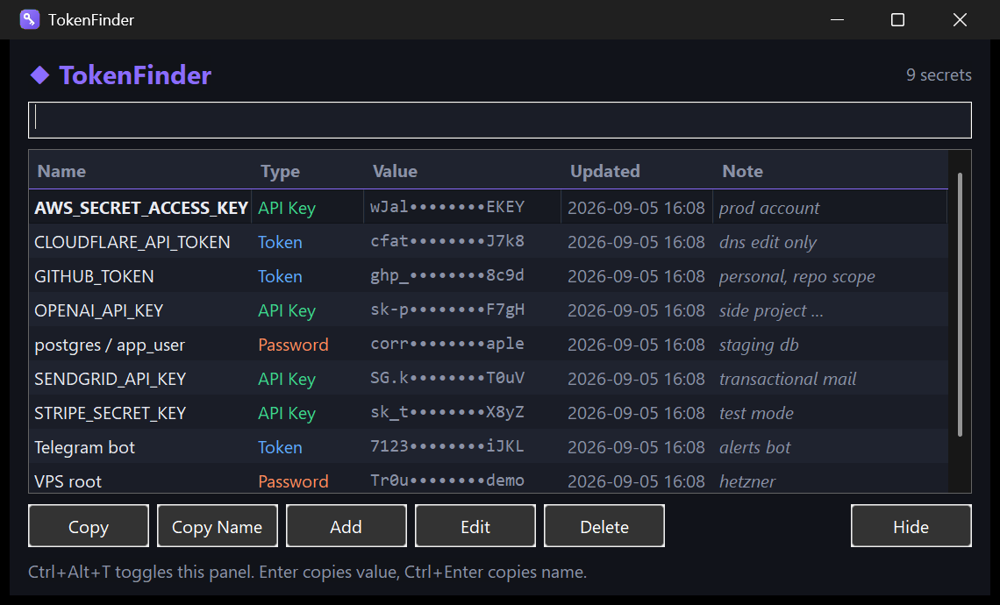

# TokenFinder

A tiny Windows tray app that keeps your tokens, API keys and passwords in an
encrypted local vault and copies them to the clipboard with one click.



## Features

- **Lives in the system tray.** Left-click the icon (or press `Ctrl+Alt+T`
  anywhere) to open the panel; it pops up next to the tray corner.
- **Search as you type.** Filters by name, type or note.
- **One-key copy.** `Enter` or double-click copies the value and hides the
  panel. `Ctrl+Enter` copies the entry name. Right-click a row for
  *Copy value / Copy name / Copy note / Edit / Delete*.
- **Clipboard auto-wipe.** Copied secrets are removed from the clipboard after
  30 seconds if the clipboard still holds them.
- **Encrypted at rest.** The vault is protected with Windows DPAPI
  (`CryptProtectData`) plus application entropy. It can only be opened by the
  same Windows user on the same machine. Nothing ever leaves your PC.
- **Dark UI.** Native Win32 controls with a dark title bar, themed controls
  and a custom-painted table. No web view, no runtime, single 6 MB exe.
- **Single instance.** Launching a second copy just brings the panel forward.
- **Start with Windows.** Toggle from the tray menu (HKCU `Run` key).

Vault location: `%APPDATA%\TokenFinder\vault.dat` (override with
`TokenFinder.exe -vault C:\path\to\vault.dat`).

## Install

### Download a release

1. Grab `TokenFinder.exe` from the
   [latest release](https://github.com/bilal-arikan/tokenfinder/releases/latest).
2. Verify the checksum against `SHA256SUMS.txt` from the same release:

   ```powershell
   Get-FileHash .\TokenFinder.exe -Algorithm SHA256
   ```

3. Put the exe anywhere (e.g. `C:\Tools\TokenFinder\`) and run it. It starts
   hidden in the tray. Right-click the tray icon and enable **Start with
   Windows** if you want it on login.

The binary is not code-signed, so SmartScreen may show "Windows protected your
PC" on first run. Click **More info → Run anyway** after checking the SHA256.

### Build from source

Requirements: [Go](https://go.dev/dl/) 1.25 or newer. No C compiler needed
(`lxn/walk` is pure Go).

```powershell
git clone https://github.com/bilal-arikan/tokenfinder.git
cd tokenfinder
.\build.ps1
```

`build.ps1` installs [`rsrc`](https://github.com/akavel/rsrc) if missing,
embeds the Common Controls v6 manifest (required by walk), builds a
windowless GUI exe into `dist\TokenFinder.exe` and writes
`dist\SHA256SUMS.txt`.

Manual equivalent:

```powershell
go install github.com/akavel/rsrc@latest
rsrc -manifest app.manifest -ico assets\icon.ico -o rsrc.syso
go build -ldflags "-H windowsgui -s -w" -o TokenFinder.exe .
```

Run the tests:

```powershell
go test ./...
```

## Usage

| Action | How |
|--------|-----|
| Open / hide panel | Left-click tray icon, or `Ctrl+Alt+T`, or `Esc` |
| Copy value | `Enter`, double-click, **Copy** button |
| Copy name | `Ctrl+Enter`, **Copy Name** button |
| Copy full note | Right-click → *Copy note* |
| Add / Edit / Delete | Buttons, right-click menu, or `Delete` key |
| Start with Windows | Tray menu → *Start with Windows* |
| Quit | Tray menu → *Exit* (closing the window only hides it) |

Entries have a name, a type (Token / API Key / Password / Other), the secret
value and a free-form multi-line note. The table shows the value masked
(`ghp_••••••••cdef`) and the first line of the note.

## Security notes

- Encryption is tied to your Windows account (DPAPI). Copying `vault.dat` to
  another machine or user will not decrypt. There is no export yet; back up by
  keeping the file on the same account.
- Secrets are held in process memory in plain text while the app runs, like
  any password manager.
- The clipboard wipe only clears the clipboard if it still contains the value
  you copied, so it never destroys something you copied afterwards.
- The global hotkey `Ctrl+Alt+T` is registered at start. If another program
  owns it, a tray notification tells you and everything else keeps working.

## Troubleshooting

- **Panel shows "0 secrets" / entries missing.** The status line shows the
  vault path when the vault is empty. Confirm it is the file you expect and
  that you are logged in as the same Windows user who created it. To inspect a
  vault without revealing values:

  ```powershell
  go run ./tools/vaultinfo                 # default vault
  go run ./tools/vaultinfo C:\path\to\vault.dat
  ```

- **Entries differ depending on how the app was started.** If TokenFinder is
  launched from a terminal that belongs to a packaged (MSIX) application, such
  as an AI assistant or editor installed from the Microsoft Store, Windows
  redirects its `%APPDATA%` writes into that package's
  `AppData\Local\Packages\<app>\LocalCache\Roaming\`. You then have two
  vaults. Start TokenFinder from Explorer, the Start menu or a scheduled task
  instead, and copy `vault.dat` from the package folder to
  `%APPDATA%\TokenFinder\` once if needed.
- **Diagnostics in the status line.** Set `TOKENFINDER_DEBUG=1` before
  starting the app to show vault path, entry counts, current filter and
  command line in the status bar.
- **"Cannot open vault" at start.** The file exists but cannot be decrypted:
  it was created by a different Windows account or machine, or it is not a
  TokenFinder vault. Move it aside to start fresh.

## Project layout

| Path | Purpose |
|------|---------|
| `main.go` | Entry point: single-instance check, vault open, UI start |
| `internal/crypto` | DPAPI `Protect` / `Unprotect` wrapper |
| `internal/store` | `Entry` model, encrypted JSON vault, search and CRUD |
| `internal/ui` | Main window, table model, add/edit dialog, tray icon, clipboard guard, dark theme, icon drawing |
| `internal/hotkey` | `RegisterHotKey` via a message-only window |
| `internal/autostart` | HKCU `Run` registry entry |
| `internal/singleinstance` | Named mutex |
| `app.manifest` | Common Controls v6 + per-monitor DPI awareness |
| `assets/icon.ico`, `tools/genicon` | App icon (embedded by rsrc); regenerate with `go generate` |
| `tools/vaultinfo` | Prints entry names and counts of a vault without values |
| `build.ps1` | Build script (exe + SHA256) |
| `.github/workflows` | CI on push, manual release workflow |

## Releasing

```powershell
.\build.ps1 -Version 1.2.3
git tag v1.2.3
git push origin main v1.2.3
gh release create v1.2.3 dist\TokenFinder.exe dist\SHA256SUMS.txt --title "v1.2.3" --notes-file dist\SHA256SUMS.txt
```

Alternatively run the **Release** workflow from the Actions tab with the tag
name; it builds on `windows-latest` and attaches the same two files.

## License

[MIT](LICENSE)
